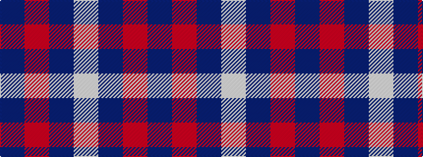

BRBW

It is a 4 stripe tartan.

<figure class="pat-woven">

<figcaption>idealised sample</figcaption>
</figure>

## Colour Sequence



## Tartans with this colour sequence

| Tartans |
|---------------|
| [Triplett, Jack Arnold](/variants/s4/w35ni12r2n2~x2/)|
||
| [Triplett, Jack Arnold](/variants/s4/w14b5r1t1~x8/)|
||
