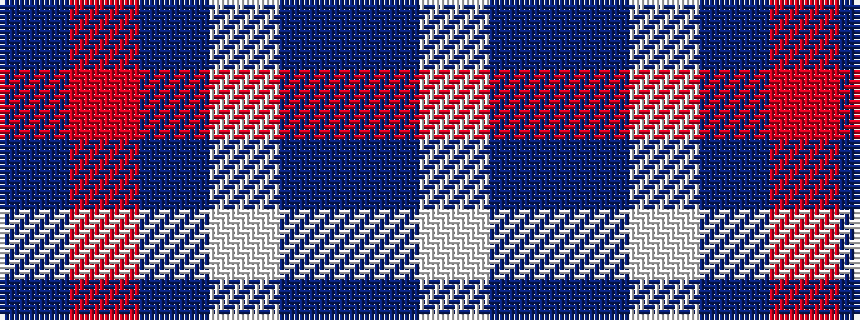

BRBWBBW

It is a 7 stripe tartan.

<figure class="pat-woven">

<figcaption>idealised sample</figcaption>
</figure>

## Colour Sequence



## Tartans with this colour sequence

| Tartans |
|---------------|
| [North Carolina](/setts/s7/db64r8db1w8db4dbi15w4~x2/)|
||
