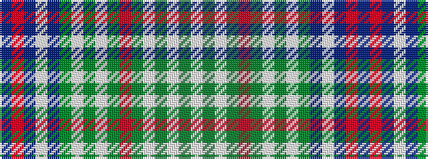

BRBWBGWGWGRGWGWG

It is a 16 stripe tartan.

<figure class="pat-woven">

<figcaption>idealised sample</figcaption>
</figure>

## Colour Sequence



## Tartans with this colour sequence

| Tartans |
|---------------|
| [Fred Perry](/setts/s16/db36r4db3w3db36g6w1g2w1g10r1g10w1g2w1g6~x2/)|
||
