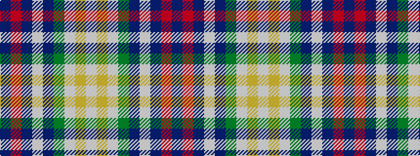

BRBWBGWYW

It is a 9 stripe tartan.

<figure class="pat-woven">

<figcaption>idealised sample</figcaption>
</figure>

## Colour Sequence



## Tartans with this colour sequence

| Tartans |
|---------------|
| [Guszcza, The (Personal)](/variants/s9/n28r2n3w2n17y8lb16lo3lb3~x2/)|
||
