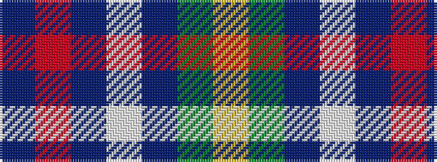

BRBWBGY

It is a 7 stripe tartan.

<figure class="pat-woven">

<figcaption>idealised sample</figcaption>
</figure>

## Colour Sequence



## Tartans with this colour sequence

| Tartans |
|---------------|
| [Barneys (Scunthorpe) (Personal)](/variants/s7/t25r10t25w8p6g8ly5~x2/)|
||
