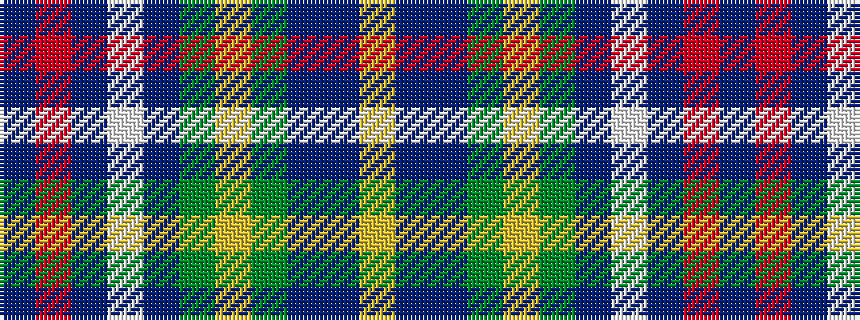

BRBWBGYGBBY

It is a 11 stripe tartan.

<figure class="pat-woven">

<figcaption>idealised sample</figcaption>
</figure>

## Colour Sequence



## Tartans with this colour sequence

| Tartans |
|---------------|
| [Wisconsin](/setts/s11/t22r3t2w3do14y20ly2y20do14t11lr6~x2/)|
||
