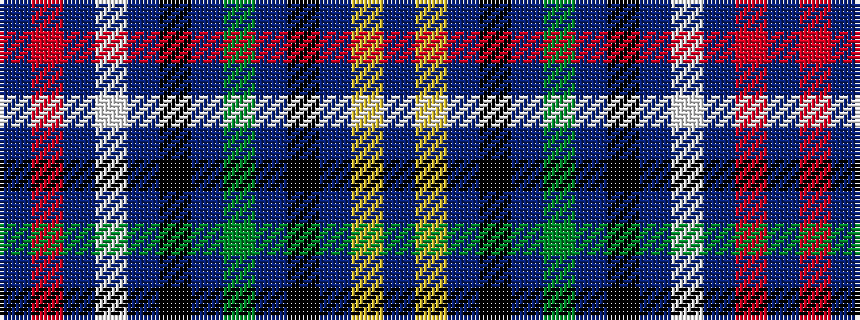

BRBWBKBGBKBYB

It is a 13 stripe tartan.

<figure class="pat-woven">

<figcaption>idealised sample</figcaption>
</figure>

## Colour Sequence



## Tartans with this colour sequence

| Tartans |
|---------------|
| [Ontario Provincial Police (Corporate](/setts/s13/db9r1db1w1db2k10db8dg2db8k10db10ly1t2~x4/)|
||
