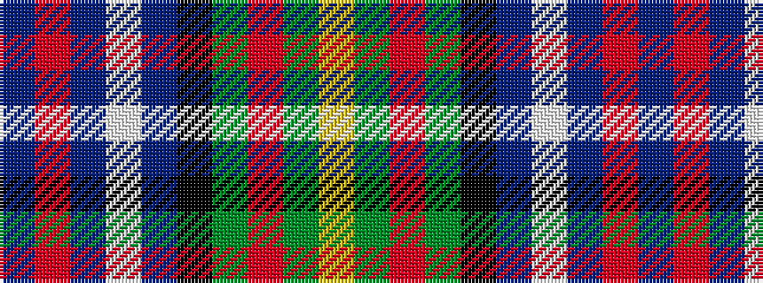

BRBWBKGRGY

It is a 10 stripe tartan.

<figure class="pat-woven">

<figcaption>idealised sample</figcaption>
</figure>

## Colour Sequence



## Tartans with this colour sequence

| Tartans |
|---------------|
| [Logan Rogers](/variants/s10/db2r2db2w1db8k8dg8r2dg2ly2~x2/)|
||
