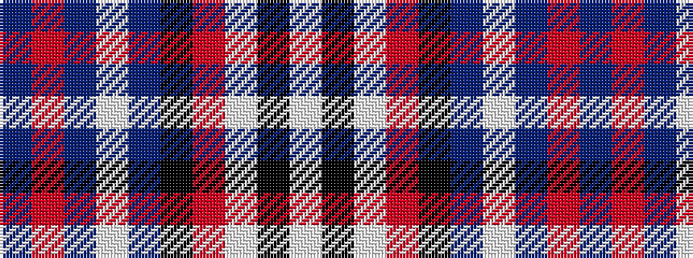

BRBWBKRWKW

It is a 10 stripe tartan.

<figure class="pat-woven">

<figcaption>idealised sample</figcaption>
</figure>

## Colour Sequence



## Tartans with this colour sequence

| Tartans |
|---------------|
| [Lochnagar Dress fashion Tartan](/variants/s10/w8k1w40m1k16db16w6db3m3db6~x2/)|
||
