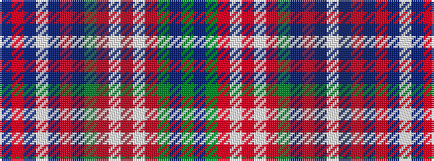

BRBWBRBGRWRWRGBG

It is a 16 stripe tartan.

<figure class="pat-woven">

<figcaption>idealised sample</figcaption>
</figure>

## Colour Sequence



## Tartans with this colour sequence

| Tartans |
|---------------|
| [Stuart-Houghton Hunting (Personal)](/setts/s16/db11o4db4w2db4o4db11dg26o4w3o4w2o14dg10db16dg6~x2/)|
||
