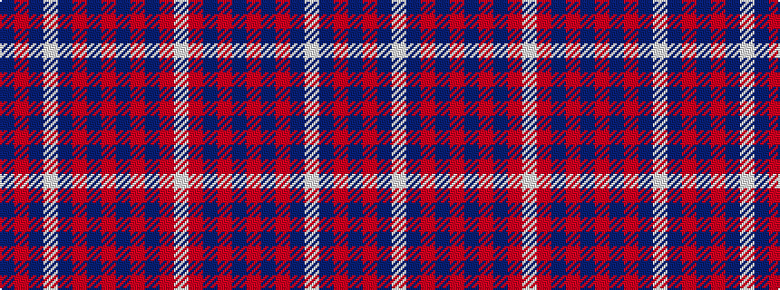

BRBWBRBRBRBRW

It is a 13 stripe tartan.

<figure class="pat-woven">

<figcaption>idealised sample</figcaption>
</figure>

## Colour Sequence



## Tartans with this colour sequence

| Tartans |
|---------------|
| [Largs (1981) (District)](/variants/s13/db4r4db44w6db5o4db3o8db3o16db4r24w4/)|
||
