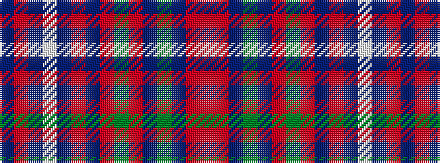

BRBWBRBRGRBGBRR

It is a 15 stripe tartan.

<figure class="pat-woven">

<figcaption>idealised sample</figcaption>
</figure>

## Colour Sequence



## Tartans with this colour sequence

| Tartans |
|---------------|
| [Caithness](/setts/s15/o28r3dr2y2dr2r3y8o2dr8o5dr3w2dr2o3dr1~x2/)|
||
