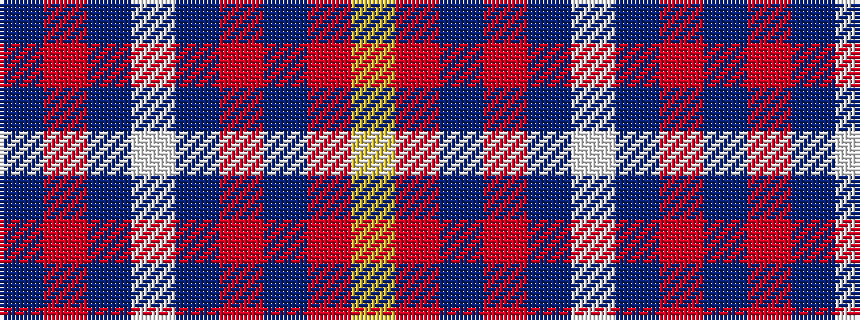

BRBWBRBRY

It is a 9 stripe tartan.

<figure class="pat-woven">

<figcaption>idealised sample</figcaption>
</figure>

## Colour Sequence



## Tartans with this colour sequence

| Tartans |
|---------------|
| [Newton Primary School](/variants/s9/db26r3db3w2db3r3db6r6ly2~x4/)|
||
