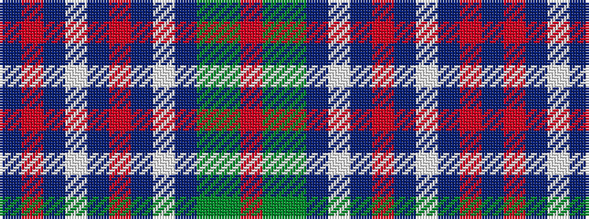

BRBWBRBWBGGR

It is a 12 stripe tartan.

<figure class="pat-woven">

<figcaption>idealised sample</figcaption>
</figure>

## Colour Sequence



## Tartans with this colour sequence

| Tartans |
|---------------|
| [Patterson, William J.M. (Personal)](/setts/s12/db9o3db2w2db9o6db3w3db3y18dg8r2~x2/)|
||
