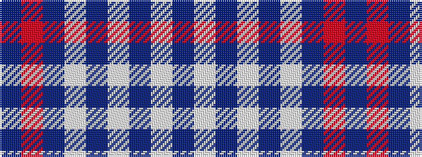

BRBWBWBWB

It is a 9 stripe tartan.

<figure class="pat-woven">

<figcaption>idealised sample</figcaption>
</figure>

## Colour Sequence



## Tartans with this colour sequence

| Tartans |
|---------------|
| [RAAF](/variants/s9/db66w2db10w2db10w2db12r3t24~x2/)|
||
| [RAAF #2](/variants/s9/db66w1dt10w1dt10w1dt12r2t24~x2/)|
||
| [RAAF #5](/variants/s9/t66w2t10w2t10w2t12r3db24~x2/)|
||
