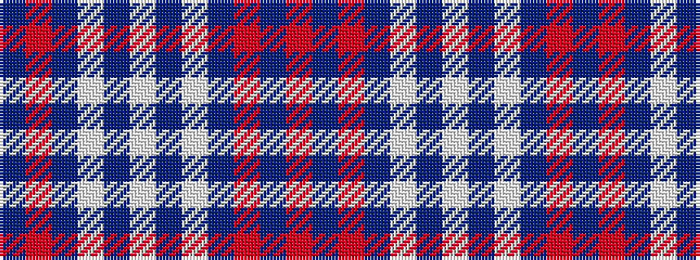

BRBWBWBWBRBR

It is a 12 stripe tartan.

<figure class="pat-woven">

<figcaption>idealised sample</figcaption>
</figure>

## Colour Sequence



## Tartans with this colour sequence

| Tartans |
|---------------|
| [Greater Victoria Police PB](/setts/s12/r7dt1r26dt31w1dt1w2~x2/)|
||
