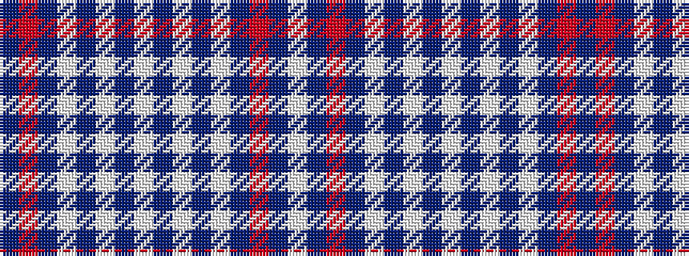

BRBWBWBWBWBWBRBW

It is a 16 stripe tartan.

<figure class="pat-woven">

<figcaption>idealised sample</figcaption>
</figure>

## Colour Sequence



## Tartans with this colour sequence

| Tartans |
|---------------|
| [Jeux Canada Games '87](/setts/s16/db6r5db3w2db3w2db3w16db3w2db3w2db3r5db6w2~x2/)|
||
