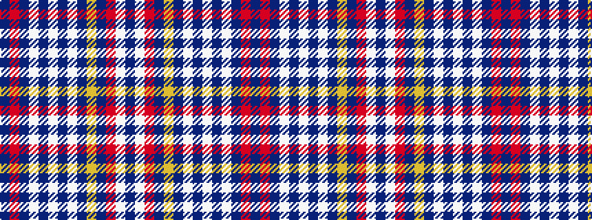

BRBWBWBWBYBRWB

It is a 14 stripe tartan.

<figure class="pat-woven">

<figcaption>idealised sample</figcaption>
</figure>

## Colour Sequence



## Tartans with this colour sequence

| Tartans |
|---------------|
| [Parker (USA)](/variants/s14/db4r6db16w4db4w4db4w4db16lo2db16r6w3db4~x2/)|
||
