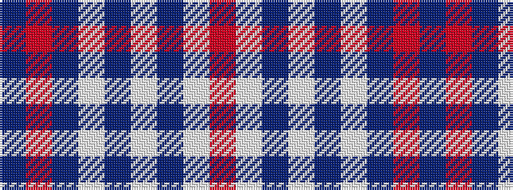

BRBWBWBWR

It is a 9 stripe tartan.

<figure class="pat-woven">

<figcaption>idealised sample</figcaption>
</figure>

## Colour Sequence



## Tartans with this colour sequence

| Tartans |
|---------------|
| [31, Tartan (The.. )](/setts/s9/db2r21db1w4db7w2db2w2r2~x2/)|
||
| [American](/setts/s9/db2r21db1lb4db7lb2db2lb2r2~x4/)|
||
