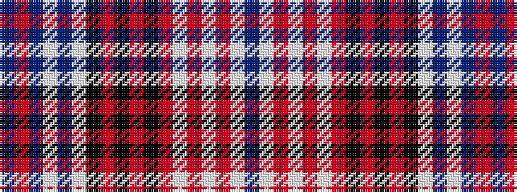

BRBWBWKRKRKRWRWRWB

It is a 18 stripe tartan.

<figure class="pat-woven">

<figcaption>idealised sample</figcaption>
</figure>

## Colour Sequence



## Tartans with this colour sequence

| Tartans |
|---------------|
| [Wcwm 1586](/setts/s18/b3w8o2w2o2w2o8k2o2k2o2k8w2b22w2b2o2b3~x2/)|
||
