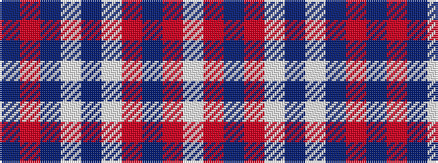

BRBWBWRBRW

It is a 10 stripe tartan.

<figure class="pat-woven">

<figcaption>idealised sample</figcaption>
</figure>

## Colour Sequence



## Tartans with this colour sequence

| Tartans |
|---------------|
| [America (Eagle version)](/setts/s10/db5r2db5w7db32w7r13db3r13w2~x2/)|
||
