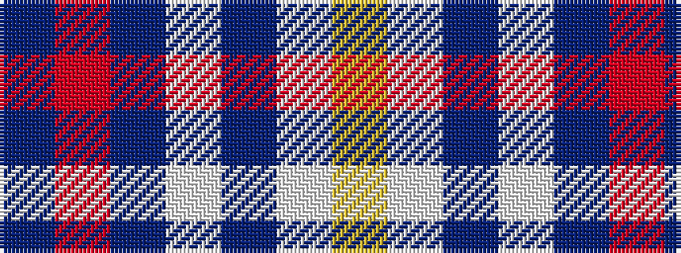

BRBWBWY

It is a 7 stripe tartan.

<figure class="pat-woven">

<figcaption>idealised sample</figcaption>
</figure>

## Colour Sequence



## Tartans with this colour sequence

| Tartans |
|---------------|
| [International Police Association (IPA 2010)](/setts/s7/db14r6db52lt4db4lt51ly8/)|
||
