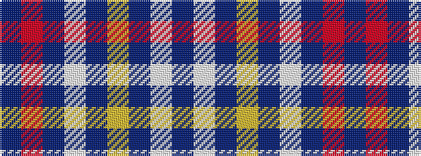

BRBWBYBWB

It is a 9 stripe tartan.

<figure class="pat-woven">

<figcaption>idealised sample</figcaption>
</figure>

## Colour Sequence



## Tartans with this colour sequence

| Tartans |
|---------------|
| [Mercer Personal Tartan](/variants/s9/db16w2db3ly4db3w2db10r35db4~x2/)|
||
| [Mercer, James (Personal)](/variants/s9/db24w3db4ly6db4w3db15r52db6/)|
||
