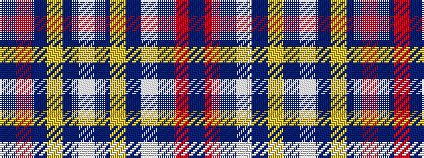

BRBWBYBWBYBRB

It is a 13 stripe tartan.

<figure class="pat-woven">

<figcaption>idealised sample</figcaption>
</figure>

## Colour Sequence



## Tartans with this colour sequence

| Tartans |
|---------------|
| [Clackson (Personal)](/setts/s13/db24r2db8w5db4ly5db4w5db4ly5db8r2db24~x2/)|
||
| [Clackson (Personal)](/setts/s13/db29r2db10w5db4lo5db4w5db4lo5db10r2db29~x2/)|
||
