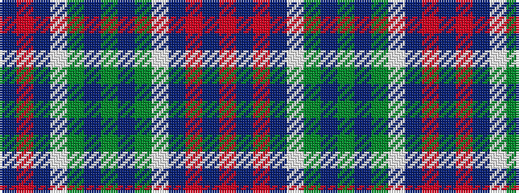

BRBWGBGBGWBRBR

It is a 14 stripe tartan.

<figure class="pat-woven">

<figcaption>idealised sample</figcaption>
</figure>

## Colour Sequence



## Tartans with this colour sequence

| Tartans |
|---------------|
| [St. Andrews (Queens University)](/variants/s14/dy11db1dy11w10db1r11db1r11~x2/)|
||
