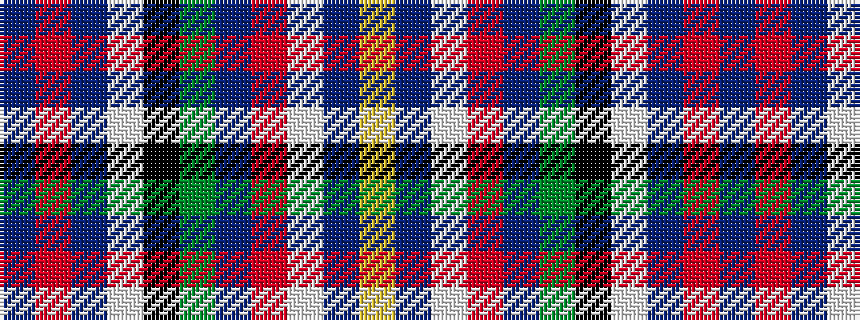

BRBWKGBRWBY

It is a 11 stripe tartan.

<figure class="pat-woven">

<figcaption>idealised sample</figcaption>
</figure>

## Colour Sequence



## Tartans with this colour sequence

| Tartans |
|---------------|
| [Arisaig (District)](/variants/s11/t4r4t12w12k4g4dt8r1w1dt1ly1~x2/)|
||
| [Arisaig NS Canada](/variants/s11/b4r4b12w12k4g4db8r1w1db1ly1~x2/)|
||
