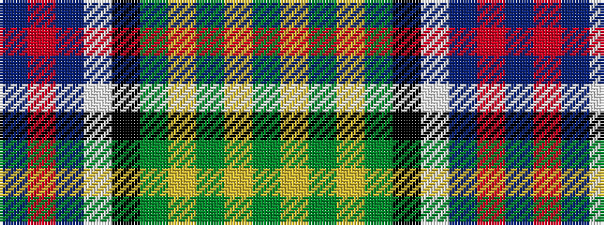

BRBWKGYGYG

It is a 10 stripe tartan.

<figure class="pat-woven">

<figcaption>idealised sample</figcaption>
</figure>

## Colour Sequence



## Tartans with this colour sequence

| Tartans |
|---------------|
| [Greene](/variants/s10/db6r4db24lb3k6g18lo4g2lo2g4~x2/)|
||
