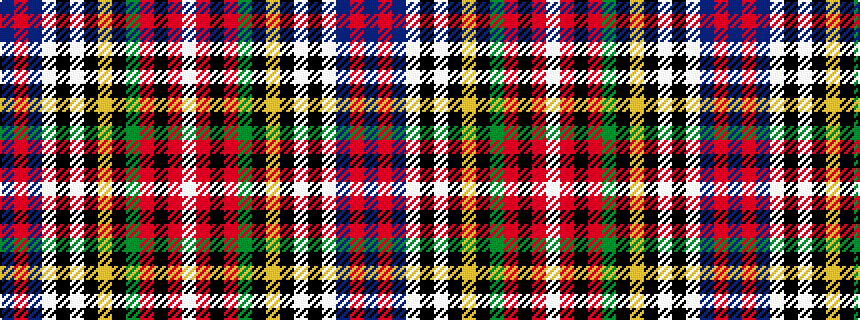

BRBWKWKYKGRKRW

It is a 14 stripe tartan.

<figure class="pat-woven">

<figcaption>idealised sample</figcaption>
</figure>

## Colour Sequence



## Tartans with this colour sequence

| Tartans |
|---------------|
| [Brown of Castledean (Artefact)](/variants/s14/db12r30db2lb2k8lb2k4ly2k4dg15r8k2r4lb2~x2/)|
||
