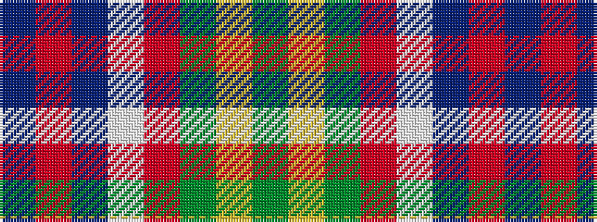

BRBWRGYG

It is a 8 stripe tartan.

<figure class="pat-woven">

<figcaption>idealised sample</figcaption>
</figure>

## Colour Sequence



## Tartans with this colour sequence

| Tartans |
|---------------|
| [Ayrshire](/setts/s8/db2r1db10w1o4g8ly1g2~x4/)|
||
| [Yorkland](/setts/s8/db30r2db4w1o11g4ly2g22~x2/)|
||
