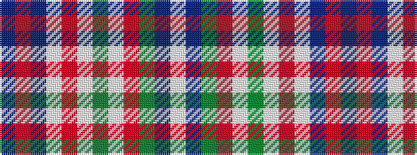

BRBWRWGWRGBW

It is a 12 stripe tartan.

<figure class="pat-woven">

<figcaption>idealised sample</figcaption>
</figure>

## Colour Sequence



## Tartans with this colour sequence

| Tartans |
|---------------|
| [Glenfalloch](/setts/s12/dt4ri1dt12w1ri4w1dg4w1r4dg12dt1w2~x2/)|
||
| [Glenfalloch Corporate Tartan Tartan Number: 2111. Earliest known date: 1990 'Glenfalloch' - Gaelic meaning "hidden valley" - was built as a private residence last century. Some years ago it was acquired by the Otago Peninsulsa Trust, to enable the people of Dunedin and visitors to the area, to enjoy the beautiful gardens. Colours were chosen to represent as follows: Navy Blue - dark shadows in valley, Green/Blue - Overall colours of sea/sky/trees, Salmon Pink/White/Maroon - Wild flowers in season. See products available Copyright © Blair Urquhart, Comrie, 2015](/setts/s12/dt4r1dt12w1r4w1g4w1ri4g12dt1w2~x2/)|
|![Glenfalloch Corporate Tartan Tartan Number: 2111. Earliest known date: 1990 'Glenfalloch' - Gaelic meaning "hidden valley" - was built as a private residence last century. Some years ago it was acquired by the Otago Peninsulsa Trust, to enable the people of Dunedin and visitors to the area, to enjoy the beautiful gardens. Colours were chosen to represent as follows: Navy Blue - dark shadows in valley, Green/Blue - Overall colours of sea/sky/trees, Salmon Pink/White/Maroon - Wild flowers in season. See products available Copyright © Blair Urquhart, Comrie, 2015 example sett](/setts/s12/dt4r1dt12w1r4w1g4w1ri4g12dt1w2~x2/sett.png)|
