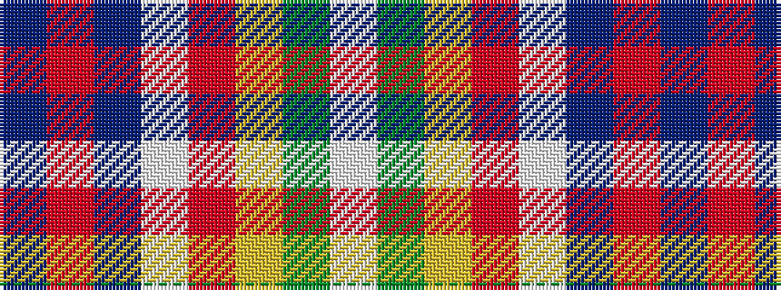

BRBWRYGW

It is a 8 stripe tartan.

<figure class="pat-woven">

<figcaption>idealised sample</figcaption>
</figure>

## Colour Sequence



## Tartans with this colour sequence

| Tartans |
|---------------|
| [Thompson, Megan Kate (Personal)](/setts/s8/dp5m8p16w25m4lr4y3lp3~x2/)|
||
