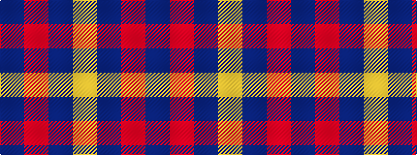

BRBY

It is a 4 stripe tartan.

<figure class="pat-woven">

<figcaption>idealised sample</figcaption>
</figure>

## Colour Sequence



## Tartans with this colour sequence

| Tartans |
|---------------|
| [Gem](/variants/s4/db140r11db14ly11/)|
||
| [MacLaine of Lochbuie](/variants/s4/db32r3db4ly3~x2/)|
||
