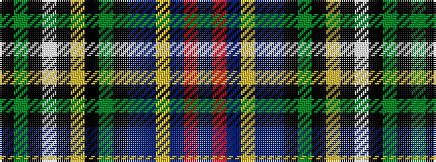

BRBYBBKGKYKWKGK

It is a 15 stripe tartan.

<figure class="pat-woven">

<figcaption>idealised sample</figcaption>
</figure>

## Colour Sequence



## Tartans with this colour sequence

| Tartans |
|---------------|
| [Malcolm (1840)](/variants/s15/k21dg21k6lb4k6ly4k6dg21k21db21db4lr4db6r4db21/)|
||
