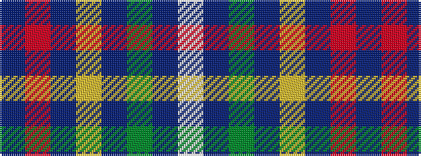

BRBYBGBW

It is a 8 stripe tartan.

<figure class="pat-woven">

<figcaption>idealised sample</figcaption>
</figure>

## Colour Sequence



## Tartans with this colour sequence

| Tartans |
|---------------|
| [De Nardi Hunting (Personal)](/setts/s8/db30r3db3ly3db3g30db36w5~x2/)|
||
