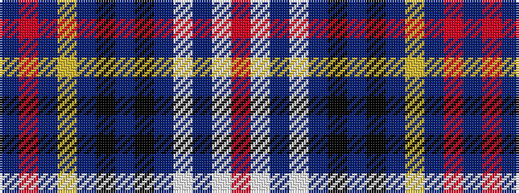

BRBYBKBKBWBWR

It is a 13 stripe tartan.

<figure class="pat-woven">

<figcaption>idealised sample</figcaption>
</figure>

## Colour Sequence



## Tartans with this colour sequence

| Tartans |
|---------------|
| [Titanic (Belfast)](/setts/s13/ni1r1ni9ly1ni7k1ni1k1ni7w4n2w4r1~x4/)|
||
