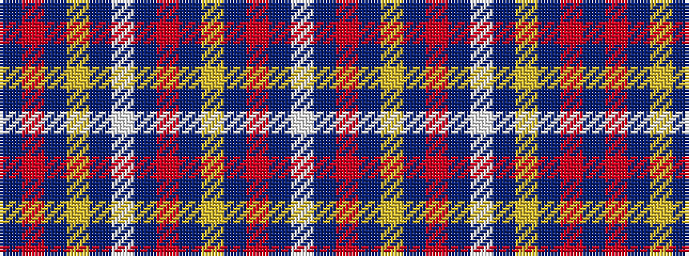

BRBYBWBRBYBRBW

It is a 14 stripe tartan.

<figure class="pat-woven">

<figcaption>idealised sample</figcaption>
</figure>

## Colour Sequence



## Tartans with this colour sequence

| Tartans |
|---------------|
| [Unidentified (Knapp)](/setts/s14/db2r9db20ly4db9w4db20r9db2ly1db2r20db2w1~x2/)|
||
