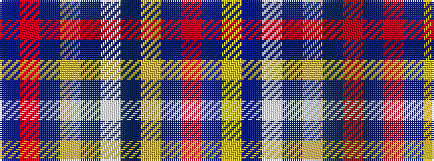

BRBYBWBYBR

It is a 10 stripe tartan.

<figure class="pat-woven">

<figcaption>idealised sample</figcaption>
</figure>

## Colour Sequence



## Tartans with this colour sequence

| Tartans |
|---------------|
| [Superfast Ferries](/setts/s10/r16db6ly4db6w1db6ly4db6r16db1~x4/)|
||
