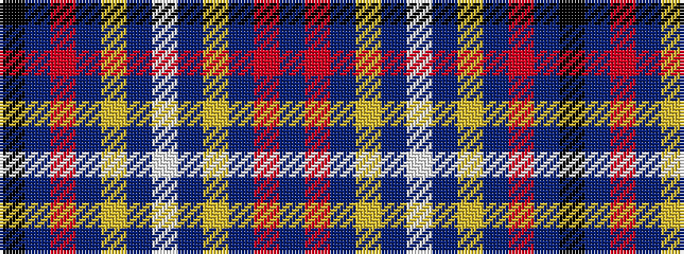

BRBYBWBYBRBK

It is a 12 stripe tartan.

<figure class="pat-woven">

<figcaption>idealised sample</figcaption>
</figure>

## Colour Sequence



## Tartans with this colour sequence

| Tartans |
|---------------|
| [Wishart Dress](/setts/s12/k7db4r31db3ly2db27lb4~x2/)|
||
