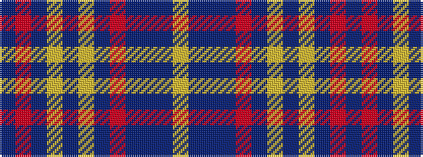

BRBYBYBRBBBY

It is a 12 stripe tartan.

<figure class="pat-woven">

<figcaption>idealised sample</figcaption>
</figure>

## Colour Sequence



## Tartans with this colour sequence

| Tartans |
|---------------|
| [Gabrielle (Fashion)](/variants/s12/n48r4n6lo2n2lr2n2r10b6n2b3lr2~x2/)|
||
