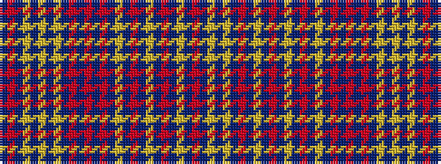

BRBYBYBYBRBRBRBYBRBYBRBYBRBYB

It is a 29 stripe tartan.

<figure class="pat-woven">

<figcaption>idealised sample</figcaption>
</figure>

## Colour Sequence



## Tartans with this colour sequence

| Tartans |
|---------------|
| [Delmarva](/variants/s29/n8r2n2lr1n1lr1n1lr1n2r2n6oi1n12oi1n6lr1n1o4n1lr1n2r3n3lr1n1o2n1lr1n8~x2/)|
||
