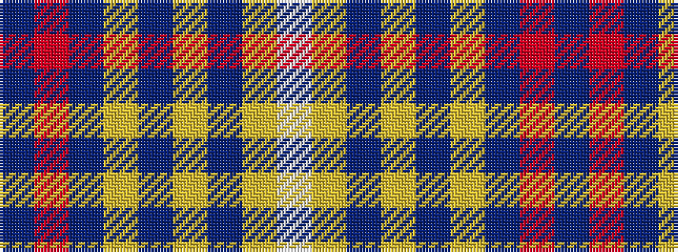

BRBYBYBYW

It is a 9 stripe tartan.

<figure class="pat-woven">

<figcaption>idealised sample</figcaption>
</figure>

## Colour Sequence



## Tartans with this colour sequence

| Tartans |
|---------------|
| [Nevada State](/setts/s9/db32r4db4ly4db9lr9db4lr16w7~x2/)|
||
