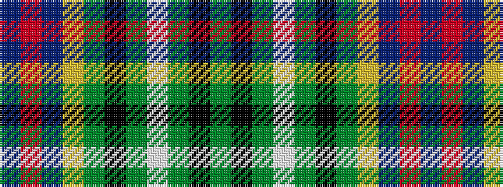

BRBYGKGWGKG

It is a 11 stripe tartan.

<figure class="pat-woven">

<figcaption>idealised sample</figcaption>
</figure>

## Colour Sequence



## Tartans with this colour sequence

| Tartans |
|---------------|
| [Presbyterian Synod (US) (Corporate)](/setts/s11/db6r2db6ly3g6k1g2lb2g2k1g6~x2/)|
||
