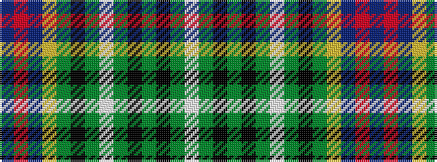

BRBYGKGWGKGKGW

It is a 14 stripe tartan.

<figure class="pat-woven">

<figcaption>idealised sample</figcaption>
</figure>

## Colour Sequence



## Tartans with this colour sequence

| Tartans |
|---------------|
| [Presbyterian Synod of Living Waters (USA)](/setts/s14/db6r2db6ly3g6k1g2lb2g2k1g6k1g2lb2~x2/)|
||
