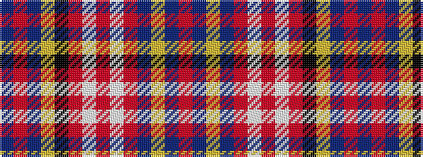

BRBYKRWRWRBYBR

It is a 14 stripe tartan.

<figure class="pat-woven">

<figcaption>idealised sample</figcaption>
</figure>

## Colour Sequence



## Tartans with this colour sequence

| Tartans |
|---------------|
| [Ogilvie #2](/setts/s14/db13r5db12ly4k5r20w4r10w4r20dbi5ly4db13r4~x2/)|
||
