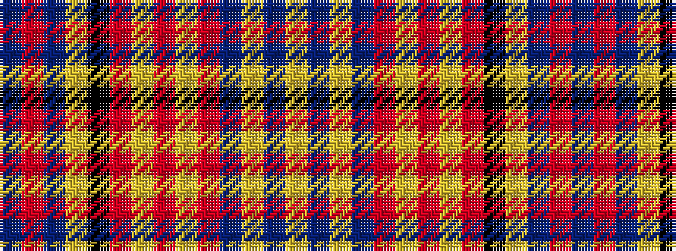

BRBYKRYRYRBYBY

It is a 14 stripe tartan.

<figure class="pat-woven">

<figcaption>idealised sample</figcaption>
</figure>

## Colour Sequence



## Tartans with this colour sequence

| Tartans |
|---------------|
| [Ogilvy](/tartans/b10r3b10ly5k2r6lr2r6lr2r6n2ly2b5lr2/)|
||
