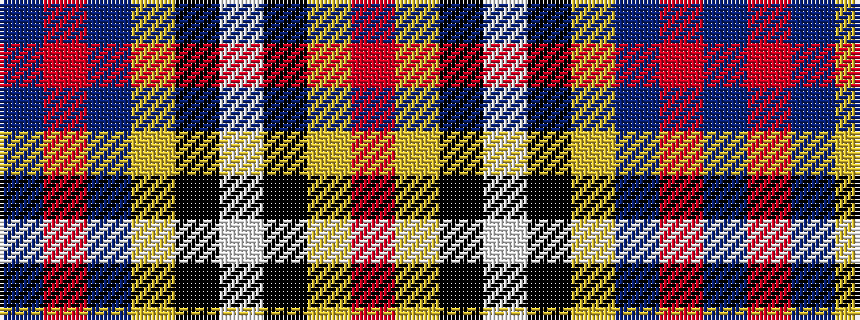

BRBYKWKYR

It is a 9 stripe tartan.

<figure class="pat-woven">

<figcaption>idealised sample</figcaption>
</figure>

## Colour Sequence



## Tartans with this colour sequence

| Tartans |
|---------------|
| [Strakan](/variants/s9/db18o5db18ly14k3w3k3ly14o3~x2/)|
||
