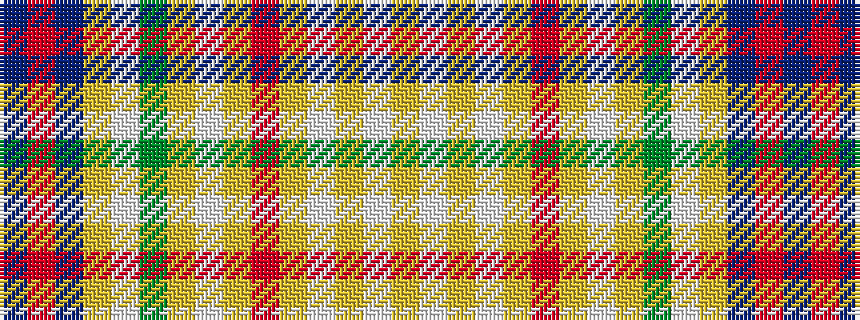

BRBYWGYWYRYWYWY

It is a 15 stripe tartan.

<figure class="pat-woven">

<figcaption>idealised sample</figcaption>
</figure>

## Colour Sequence



## Tartans with this colour sequence

| Tartans |
|---------------|
| [Druid (Corporate)](/setts/s15/dp3o2dp3ly2w4g8ly2w4ly2r8ly2w20ly2w62ly2/)|
||
