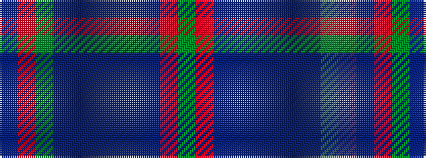

BRGBBBBBBRG

It is a 11 stripe tartan.

<figure class="pat-woven">

<figcaption>idealised sample</figcaption>
</figure>

## Colour Sequence



## Tartans with this colour sequence

| Tartans |
|---------------|
| [Maine State](/variants/s11/g2r2t23db2t2db6t2db2g33r2t2~x2/)|
||
| [Maine State District Tartan](/variants/s11/g2r2t21db2t2db6t2db2g33r2t2~x2/)|
||
