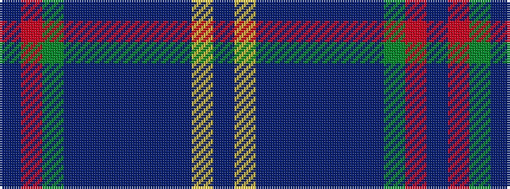

BRGBBBBBBYB

It is a 11 stripe tartan.

<figure class="pat-woven">

<figcaption>idealised sample</figcaption>
</figure>

## Colour Sequence



## Tartans with this colour sequence

| Tartans |
|---------------|
| [Limerick](/setts/s11/dr6ly4dr3db2dr5db2dr3db2g15r3db2~x2/)|
||
| [Limerick, County](/setts/s11/do6lo4do3dt2do5dt2do3dt2y14r3dt2~x2/)|
||
