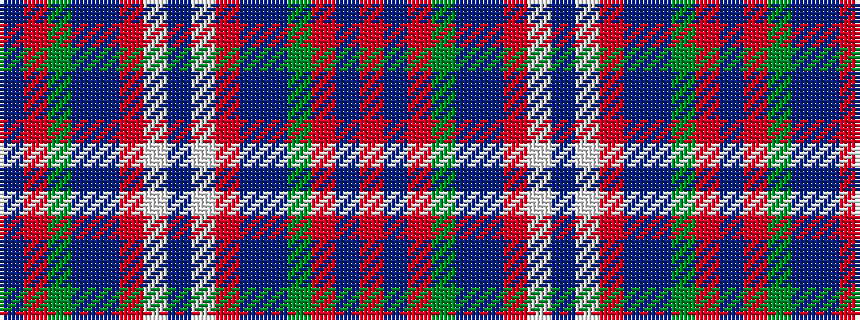

BRGBBRWBWRBBGRBR

It is a 16 stripe tartan.

<figure class="pat-woven">

<figcaption>idealised sample</figcaption>
</figure>

## Colour Sequence



## Tartans with this colour sequence

| Tartans |
|---------------|
| [Norwich No.056](/variants/s16/r5db1r5g13db8t5r5w1db3~x2/)|
||
